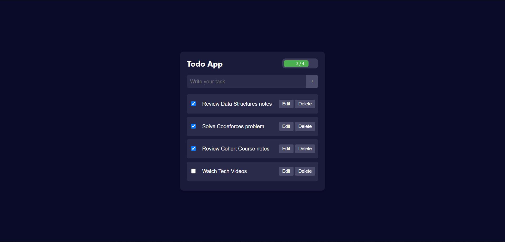

# Enhanced To-Do List Application

## Project Description
The Enhanced To-Do List is a responsive and dynamic web application built using HTML, CSS, and JavaScript. It allows users to create, edit, and manage tasks efficiently with the following features:

- **Add Tasks**: Users can easily add tasks to the list with a simple click or by pressing the 'Enter' key.
- **Task Completion Tracking**: Tasks can be marked as completed using a checkbox, and the progress bar dynamically updates to reflect the completion rate.
- **Edit & Delete Tasks**: Users can edit or delete tasks at any time. The list also uses smooth animations to enhance the user experience.
- **LocalStorage Integration**: The app saves tasks in the browser’s local storage so that tasks persist even after the page is reloaded.
- **Fully Responsive**: The design is optimized for various screen sizes, ensuring a seamless experience across all devices.

## Key Features
- **Progress Bar**: Displays real-time progress based on completed tasks.
- **Local Storage Support**: Stores tasks so they’re retained even when the page is refreshed.
- **Editable Tasks**: Users can update or modify task descriptions easily.
- **Task Deletion**: Remove tasks efficiently with smooth UI transitions.

## Technologies Used
- **HTML**
- **CSS**: For responsive and modern UI
- **JavaScript**: For dynamic behavior and LocalStorage functionality
  
## Live Demo
Check out the live demo of the Todo App [here](https://todo-app-six-weld-71.vercel.app/).

## Screenshots

